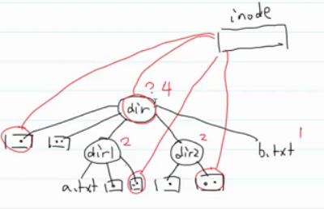
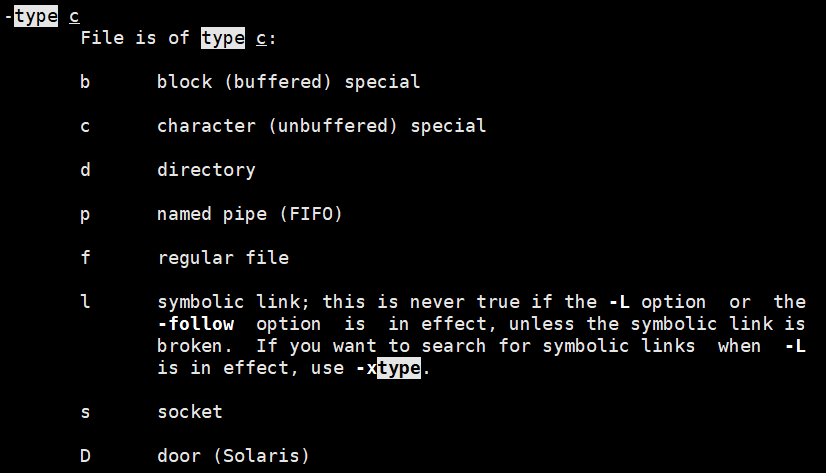
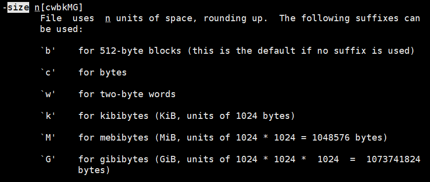

- man手册 #Linux/常用命令 #Linux/搜索
  collapsed:: true
	- ```cpp
	       1   Executable programs or shell commands
	       2   System calls (functions provided by the kernel)
	       3   Library calls (functions within program libraries)
	       4   Special files (usually found in /dev)
	       5   File formats and conventions, e.g. /etc/passwd
	       6   Games
	       7   Miscellaneous (including macro packages and conventions), e.g. man(7), groff(7)
	       8   System administration commands (usually only for root)
	       9   Kernel routines [Non standard]
	  ```
- pwd #Linux/常用命令
  collapsed:: true
	- `print working directory`：打印当前工作目录
- cd #Linux/常用命令 #Linux/文件系统/目录操作 #Linux/目录
  collapsed:: true
	- 改变当前目录
	- cd /：切换到根目录
	- cd ~：切换到用户的家目录
	- cd .：当前目录，`.`代表当前目录
	- cd ..：返回上级目录，`..`代表上一层目录
	- cd -：切换到上一次目录
		- env查看环境变量
		- 最后一行OLDPWD环境变量记录了上一次访问的目录
- rmdir #Linux/常用命令 #Linux/文件系统/目录操作 #Linux/目录
  collapsed:: true
	- `rmdir - remove empty directories`，只能删除空的文件夹，防止误删数据
- mkdir #Linux/常用命令 #Linux/文件系统/目录操作 #Linux/目录
  collapsed:: true
	- 可以一次性创建多个文件夹
- ls -a -l -h -i #Linux/常用命令 #Linux/文件系统/目录操作 #Linux/目录
  collapsed:: true
	- 1.**`ls - list directory contents`**
	- 展示当前工作目录下的内容
	- `ls [OPTION]... [FILE]...`后面加目录可以展示该目录的内容
	-
	- **在Linux中以`.`开头的文件或者文件夹就是隐藏文件。**
	- `-a, --all`
	                `do not ignore entries starting with .`
		- 显示所有文件，包括隐藏文件
	- `-l     use a long listing format`：long：展示详细信息
	- ```
	  total 8
	  drwxrwxr-x 9 ubuntu ubuntu 4096 May 19 22:45 Chapter01
	  drwxrwxr-x 3 ubuntu ubuntu 4096 Jun 22 07:56 wangdao
	  ```
		- drwxrwxr-x：文件类型+权限
			- d：directory：目录
				- -：普通文件
				- l：symbolic link：符号链接，软连接
				- c：character：字符设备文件
					- 输入和输出字符的设备：键盘、显示器
				- b：block，块设备文件
					- 输入输出一块一块的传，磁盘
				- p：pipe：管道文件
					- 进程间通信的一种机制
				- s：socket：套接字
					- 用于网络通信的一种机制
			- rwx
				- r：read，读权限
				- w：write，写权限
				- x：execute：执行权限
			- 第一组：用户的权限
			- 第二组：用户所在的组内其他成员的权限
			- 第三组：其他人的权限。
		- 第一个数字：表示硬链接数目。
		- 第一个ubuntu：文件所有者的名字
		- 第二个：文件所有者所在的组
		- 4096：文件的大小
		- `May 19 22:45`：上一次修改的时间
		- `Chapter01`：文件名
	- `-h, --human-readable`
	                `with -l and -s, print sizes like 1K 234M 2G etc.`
		- 以人类可读的方式显式。因为有的文件太大了，显示数字不好看，如下面显示4k，就好看了，一目了然有多大
		- ```
		  ubuntu@VM-16-2-ubuntu:~/My_Code/wangdao$ ls -l -h
		  total 4.0K
		  drwxrwxr-x 2 ubuntu ubuntu 4.0K Jun 22 07:53 LinuxDay02
		  ```
	- `-i, --inode`
	                `print the index number of each file`
		- 打印inode结点
		- ```
		  ubuntu@VM-16-2-ubuntu:~/My_Code/wangdao$ ls -i
		  789762 LinuxDay02
		  
		  ubuntu@VM-16-2-ubuntu:~/My_Code/wangdao$ ls -li
		  total 4
		  789762 drwxrwxr-x 2 ubuntu ubuntu 4096 Jun 22 07:53 LinuxDay02
		  ```
	-
- cp -r -i -v -u #Linux/常用命令 #Linux/文件系统/目录操作 #Linux/目录
  collapsed:: true
	- `cp - copy files and directories`复制文件或目录
	- ```
	  cp file1 file2
	  将file1复制到file2
	  ```
		- 如果file2不存在，则创建，如果file2存在，则会覆盖原有的内容
	- ```
	  -i, --interactive
	                prompt before overwrite (overrides a previous -n option)
	                
	  ubuntu@VM-16-2-ubuntu:~$ cp dir1 dir2 -rvi
	  cp: overwrite 'dir2/dir1/c.txt'? y
	  'dir1/c.txt' -> 'dir2/dir1/c.txt'
	  cp: overwrite 'dir2/dir1/a.txt'? y
	  'dir1/a.txt' -> 'dir2/dir1/a.txt'
	  //y表示确认，其他字符表示不覆盖
	  ```
		- 在cp的时候给予提示，交互的方式
	- `cp file dir`
		- 把文件复制到dir目录，dir一定要存在，不然就会把他当成文件，默认创建了一个文件，就不对了。
		- 如：
			- ```
			  ubuntu@VM-16-2-ubuntu:~$ cp a.txt dir
			  -rw-rw-r--  1 ubuntu ubuntu   13 Jun 22 10:54 dir
			  dir是个普通文件
			  ```
	- `cp dir1 di2 -r`    -r表示递归复制
		- ```
		  -R, -r, --recursive
		                copy directories recursively
		  ```
		- ```
		  不加r，会提示
		  ubuntu@VM-16-2-ubuntu:~$ cp dir1 dir2
		  cp: -r not specified; omitting directory 'dir1'
		  
		  ubuntu@VM-16-2-ubuntu:~$ cp dir1 dir2 -r
		  ubuntu@VM-16-2-ubuntu:~$ ls dir2
		  dir1
		  //将整个目录复制到了dir2
		  ```
		- 如果dir2存在，则会将dir1以及dir1中所有内容复制到dir2中。
		- 如果dir2不存在，则首先创建dir2，并复制dir1里面的内容到dir2中，不包括dir1了。
	- 打印一些详细信息  -v
		- ```
		  -v, --verbose
		                explain what is being done
		  
		  ubuntu@VM-16-2-ubuntu:~$ cp dir1 dir2 -rv
		  'dir1/a.txt' -> 'dir2/dir1/a.txt'
		  'dir1/c.txt' -> 'dir2/dir1/c.txt'
		  ```
	- -u。只复制最新的数据或者dir2没有的数据。
		- ```
		  -u, --update
		                copy only when the SOURCE file is newer than the destination file or when the  desti‐
		                nation file is missing
		  
		  ubuntu@VM-16-2-ubuntu:~$ cp dir1 dir2 -rvu
		  'dir1/a.txt' -> 'dir2/dir1/a.txt'
		  ```
	-
- mv -i -v -u #Linux/常用命令 #Linux/文件系统/目录操作 #Linux/目录
  collapsed:: true
	- `mv - move (rename) files`
	- `mv file1 file2`
		- 把file1移动到file2里去
		- 如果file2不存在，则会创建文件，然后移动到file2
		- 如果文件存在，则会覆盖原来的文件的内容
	- 交互的方式进行mv，就像cp的-i
		- ```
		  -i, --interactive
		                prompt before overwrite
		  ```
	- `mv file dir`
		- dir一定要存在，不然也会被当作文件
		- ```
		  //文件不存在
		  ubuntu@VM-16-2-ubuntu:~$ mv c.txt d
		  -rw-rw-r--  1 ubuntu ubuntu     0 Jun 22 11:15 d
		  
		  ubuntu@VM-16-2-ubuntu:~$ mv c.txt b
		  ubuntu@VM-16-2-ubuntu:~$ ls b
		  a.txt  c.txt
		  ```
	- `mv dir1 dir2`
		- 把一个目录移动到另外一个目录里
		- 如果dir2不存在，作用就相当于重命名dir1
		- 如果存在，将dir1整个移动到dir2目录下面去
	- -v：显示详细信息
		- ```
		  -v, --verbose
		                explain what is being done
		  ```
	- -u：同cp -u
		- ```
		  -u, --update
		                move  only when the SOURCE file is newer than the destination file or when the desti‐
		                nation file is missing
		  ```
- rm -i、-f、-r、-v #Linux/常用命令 #Linux/文件系统/目录操作 #Linux/目录
  collapsed:: true
	- `rm - remove files or directories`
		- 删除文件和文件夹
	- `-i     prompt before every removal`
		- 每次删除之前都给予提示
		- ```
		  ubuntu@VM-16-2-ubuntu:~$ rm c.txt -i
		  rm: remove regular empty file 'c.txt'? p
		  //只有y是确认删除，其他都不是
		  ```
	- 递归删除目录-r
		- ```
		  -r, -R, --recursive
		                remove directories and their contents recursively
		  ```
	- ```
	  -v, --verbose
	                explain what is being done
	  ```
	- -f：强制删除，不会有任何提示
		- ```
		  -f, --force
		                ignore nonexistent files and arguments, never prompt
		  ```
- alias 别名 #Linux/常用命令
  collapsed:: true
	- ```cpp
	  ubuntu@VM-16-2-ubuntu:~$ alias
	  alias alert='notify-send --urgency=low -i "$([ $? = 0 ] && echo terminal || echo error)" "$(history|tail -n1|sed -e '\''s/^\s*[0-9]\+\s*//;s/[;&|]\s*alert$//'\'')"'
	  alias egrep='egrep --color=auto'
	  alias fgrep='fgrep --color=auto'
	  alias grep='grep --color=auto'
	  alias l='ls -CF'
	  alias la='ls -A'
	  alias ll='ls -alF'
	  alias ls='ls --color=auto'
	  
	  alias his='history' 可以起别名，但只是临时设置，重连就没了。
	  ```
- history 可以查看前面执行过那些命令 #Linux/常用命令 #Linux/搜索
  collapsed:: true
	- `ubuntu@VM-16-2-ubuntu:~$ history > h.txt`可以保存执行过的命令信息
- 链接
  collapsed:: true
	- ln - make links between files #Linux/常用命令
	  collapsed:: true
		- inode怎么和磁盘关联起来的？存一个磁盘块地址很容易就找到了。
		- ### 1.`ln file link_hard`硬链接
			- 
			- 在虚拟文件系统中创建一个名称，并关联到file的inode，删除就是断开一个链接，当链接数为0时就删除inode。所以inode中有一个引用计数refcount，当其为0时，才会真正删除文件--->引用计数法
			- **缺陷：**
				- 硬链接只能链接文件，不能硬链接到目录
					- 
					- 如果链接了，那么-r递归就会死循环了
				- **不能够链接到另外的磁盘分区**
					- 每个物理磁盘的分区都有自己的inode
		- ### 2.`ln -s file/dir lin_sym`软链接
			- 软链接就是创建了一个文件，只是他的磁盘空间存的file/dir的路径，结果就相当于指向被链接的文件。
			- 
			- 操作符号链接，相当于操作它指向的文件。
				- 软连接有inode结点吗？有
			- 可以指向任何位置的文件或目录
			- **缺陷：**可能出现悬空链接问题
				- 就是把源文件删了，但是软链接还在，不会被删，就悬空链接了。
			- 
				- .和..是硬链接。dir1之所以硬链接有两个是因为：
					- dir1自己有一个硬链接到它的inode结点，然后.有一个硬链接到他的inode结点。所以是两个。dir有四个是因为：自己有硬链接、加一个.，再加上两个子目录的..就是四个了。
					- 
					-
- 创建文件
  collapsed:: true
	- touch #Linux/常用命令
	  collapsed:: true
		- `touch - change file timestamps`
			- 若文件不存在，就创建一个新的空文件
			- 若文件存在，则改变最近修改时间。
	- echo #Linux/常用命令
	  collapsed:: true
		- `echo - display a line of text`
			- `echo hello > b.txt`
				- `>`：重定向，echo是从stdin读取输入的数据，显示到stdout，但是使用重定向，可以把数据输入到文件，若没有文件就创建那个文件，然后输入。
	- vim #Linux/常用命令
- 查找文件 #Linux/常用命令 #Linux/搜索
  collapsed:: true
	- ## 1.which
		- `which - locate a command`
			- 查找可执行程序，通过PATH环境变量查找命令的具体位置
				- 当你执行一个可执行程序，然后不知道是哪个版本时，可以which
			- `PATH=/usr/local/sbin:/usr/local/bin:/usr/sbin:/usr/bin:/sbin:/bin:/usr/games:/usr/l`
				- env打开环境变量，运行一个命令时，OS就从环境变量的PATH一个一个路径的找命令，没找到就报错了，找到就执行。
	- ## 2.find
		- `find - search for files in a directory hierarchy`
			- 在某个目录的层次结构中去查找文件（子目录都要查）
				- 相当于在win的文件管理器里面，在某个具体文件路径下搜索。
		- `find 目录 查找条件`
			- `-name`：根据名字查找
				- 可以用通配符进行模糊查找`find /usr/include -name std*.h`
			- `-type`
				- 
					- man进入之后输入/ 查找，点n查找下一个。
				- ```
				  ubuntu@VM-16-2-ubuntu:~/My_Code$ find . -type l
				  ./wangdao/LinuxDay03/linktotest
				  ```
			- **组合查找**
				- `-a (and)`
					- ```
					  ubuntu@VM-16-2-ubuntu:~/My_Code/wangdao/LinuxDay03$ find . -name "link*" -a -type f
					  ./linkTotest
					  ```
				- `-o (or)`
					- ```
					  ubuntu@VM-16-2-ubuntu:~/My_Code/wangdao/LinuxDay03$ find . -name "link*" -o -type f
					  ./linktotest
					  ./linkTotest
					  ./test
					  ./test.c
					  ```
				- `! (not)`
					- ```
					  ubuntu@VM-16-2-ubuntu:~/My_Code/wangdao/LinuxDay03$ find . ! -type f
					  .
					  ./linktotest
					  ```
					- 注意`!`的位置
			- 根据用户名和组名查找
				- ```
				  ubuntu@VM-16-2-ubuntu:~/My_Code/wangdao/LinuxDay03$ find . -user luyimin
				  ./test.txt
				  ```
				- ```
				  ubuntu@VM-16-2-ubuntu:~/My_Code/wangdao/LinuxDay03$ find -uid 1002
				  ./test.txt
				  //cat /etc/passwd查看uid
				  ```
			- 根据权限查找：`-perm (permission)`
				- 用户：u，组：g，其他人：o，a=all
				- **用三个八进制数可以表示权限**
				- 常见的：
					- 664：rw-rw-r--
					- 775：rwxrwxr-x
				- ```
				  ubuntu@VM-16-2-ubuntu:~/My_Code/wangdao/LinuxDay03$ find . -perm 777
				  ./linktotest
				  ```
			- 根据大小查找：`-size`
				- 
				- rounding up：向上取整
				- b不是byte是block，c才是
				- 默认以b为单位
				- ```
				  ubuntu@VM-16-2-ubuntu:~/My_Code/wangdao/LinuxDay03$ ls -lh
				  total 32K
				  lrwxrwxrwx 1 ubuntu  ubuntu    6 Jun 23 10:11 linktotest -> test.c
				  -rw-rw-r-- 2 ubuntu  ubuntu   49 Jun 23 09:10 linkTotest
				  -rwxrwxr-x 1 ubuntu  ubuntu  17K Jun 23 09:10 test
				  -rw-rw-r-- 2 ubuntu  ubuntu   49 Jun 23 09:10 test.c
				  -rw-rw-r-- 1 luyimin luyimin   6 Jun 23 11:18 test.txt
				  ubuntu@VM-16-2-ubuntu:~/My_Code/wangdao/LinuxDay03$ find . -size 1k
				  ./linktotest
				  ./test.txt
				  ./linkTotest
				  ./test.c
				  //向上取整，所以有这么多
				  ```
				- ```
				  ubuntu@VM-16-2-ubuntu:~/My_Code/wangdao/LinuxDay03$ find . -size +30c
				  .
				  ./linkTotest
				  ./test
				  ./test.c
				  //+表示大于，不包含30bytes
				  //-表示小于
				  //find . -size 30c  =30c精确查找11：35
				  ```
				- ```
				  //找空文件
				  ubuntu@VM-16-2-ubuntu:~/My_Code/wangdao/LinuxDay03$ find . -size 0
				  ./a.txt
				  //但是这样找不到空目录，因为任何目录都有.和..两个目录，是有大小的。
				  ```
				- `-empty`：查找空目录和文件
					- `find . -empty`
			- 按照时间查找：
				- ```
				  -amin n
				                File was last accessed n minutes ago.
				                //a：access
				                //min：minute
				                访问时间
				  -atime n
				                File was last accessed n*24 hours ago.  When find figures out how many
				                24-hour periods ago the file was last accessed, any fractional part is
				                ignored, so to match -atime +1, a file has to have  been  accessed  at
				                least two days ago.
				                //time：天
				  -mmin、-mtime
				  	//m：modified，修改--->文件内容发生修改
				  -cmin、-ctime
				  	//c：status change--->文件数据元（例如权限等）最后一次修改时间。如文件权限状态发生修改
				  
				  ```
				- ```
				  ~/Ubuntu_Notes$ find . -mmin -5   5分钟以内
				  ~/Ubuntu_Notes$ find . -mmin +5   5分钟以外
				  ~/Ubuntu_Notes$ find . -mmin 5    5分钟精确查找
				  ```
			-
- 查看文件内容 #Linux/常用命令
  collapsed:: true
	- ## 1.cat #Linux/常用命令
		- `cat - concatenate files and print on the standard output`
			- 将文件流拼接到stdout末尾。会显示全部
	- ## 2.more 和 less #Linux/常用命令
		- 分页浏览。
		- q：quit。
		- `more/less 文件`
	- ## 3.head #Linux/常用命令
		- `head - output the first part of files`
			- 显示文件开头，默认显示10行
		- `$ head xx.txt -n 20`
		- -n改变显示行数
	- ## 4.tail #Linux/常用命令
		- `tail - output the last part of files`
		- 同上
- 搜索文件内容 #Linux/常用命令 #Linux/搜索
  collapsed:: true
	- ## 1.grep #Linux/常用命令
	  collapsed:: true
		- `grep, egrep, fgrep, rgrep - print lines that match patterns`
			- 打印符合正则表达式的所有行
		- G：gloabally：全局的
		- R：regular expression：正则表达式
		- P：print：打印
		- ```
		  -E, --extended-regexp
		                Interpret PATTERNS as extended regular expressions (EREs, see below).
		  -n, --line-number
		                Prefix each line of output with the 1-based  line  number  within  its
		                input file.
		                打印行号，行号从1开始
		  ```
		- **正则表达式：**
			- 基本单位：字符、转义序列、[abc] (类似集合)、(另一个正则expr)、. (匹配任意一个字符)
			- 基本操作：操作的对象是基本单位。
				- 1.连接 ：“ab”、”[abc]x“-->匹配ax、bx、cx、".txt"-->匹配四个字符?txt，要匹配.txt后缀需要转义："\.txt"
					- [^abc]-->取反
				- 2.重复
					- +：至少重复一次
					- ？：重复0次或者1次
					- *：重复任意次数--->".*" 匹配所有数据：贪婪式的匹配，每次尽量匹配多的字符
					- {m,n}：至少重复m次，至多重复n次
					- {m}：重复m次     [m,n]
					- {m,}：至少重复m次
					- {,n}：至多重复n次
			- 指定基本单位出现的位置
				- ^：行首："^abc"
				- $：行尾：“abc$”
				- \<：词首
				- \>：词尾
			- 
				- 匹配以f开头t结尾的单词  15：00
			-
	- ## 2.管道 #Linux/常用命令
	  collapsed:: true
		- `$ sort a.txt | uniq`
			- a.txt --> sort --> 管道 --> uniq --> 显示器
			- sort排序，uniq去除相邻的重复行
			- 把前一个命令的结果当作后一个命令的输入。
		- 
			- xargs把前面命令的每一行当作后面命令的参数。
				- 如果不加，那么前面命令的结果只会是后面命令的输入操作对象，而不是参数；故对于grep来说，就是在前面的输出的结果里面找main(，结果肯定没有。
			-
	- ## 3.命令的组合 #Linux/常用命令
	  collapsed:: true
		- cmd1 ; cmd2
			- 执行cmd1后执行cmd2，即顺序执行
		- cmd1 | cmd2
			- cmd2的输入是cmd1的结果
		-
		- cmd1 |xargs cmd2
			- 会把cmd1的结果的每一行作为cmd2的参数去使用
	- **小结：**查看文件内容、搜索文件内容时会使用正则，其他时候一般是通配符
-