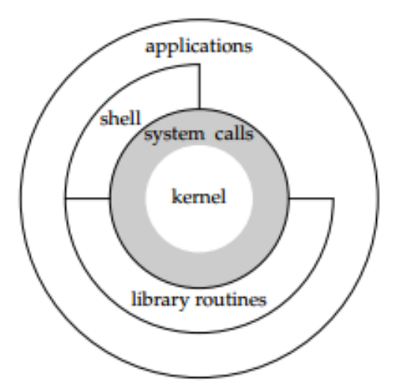

- Linux系统架构 #Linux/系统
  collapsed:: true
	- 
	- ## 1.内核
		- 1. 管理硬件资源
		  1. CPU
		  2. 内存
		  3. 外部设备
		  4. 文件管理、内存管理、进程调度、网络通信、硬件驱动管理...
		  2. 为上层应用提供运行环境
	- ## 2.系统调用
		- **系统调用**：内核给上层应用程序提供的接口。
	- ## 3.库函数
		- **库函数**：对系统调用进行封装，方便程序员使用。
		  ```ad-note
		  scanf和printf就是库函数，进行系统调用输入输出。
		  ```
	- ## 4.shell
		- **shell**：命令行解释器
		  命令：一些简单的程序。  
		  脚本（script）：命令的集合  
		    
		  ```ad-note
		  有三种方式使用内核功能。系统调用、shell、库函数
		  ```
-