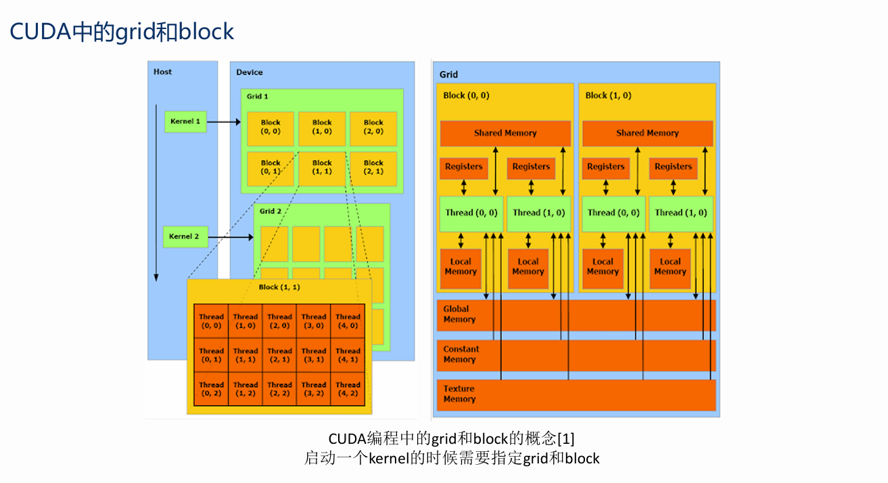
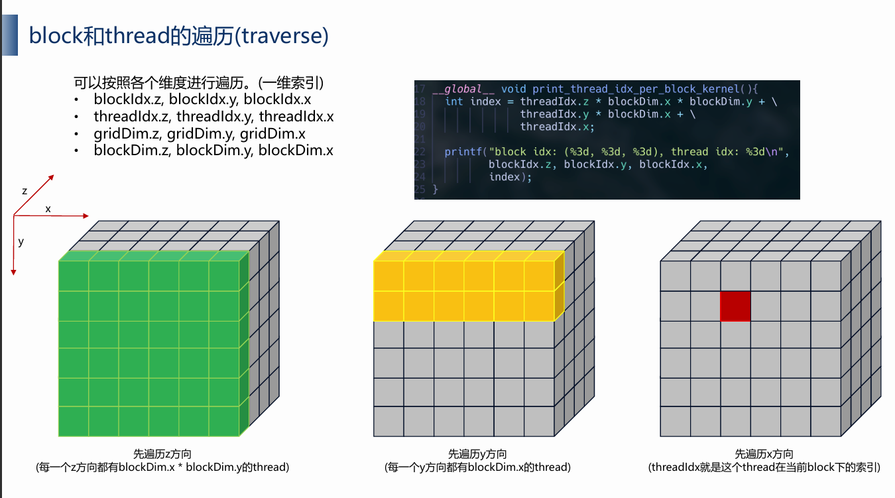
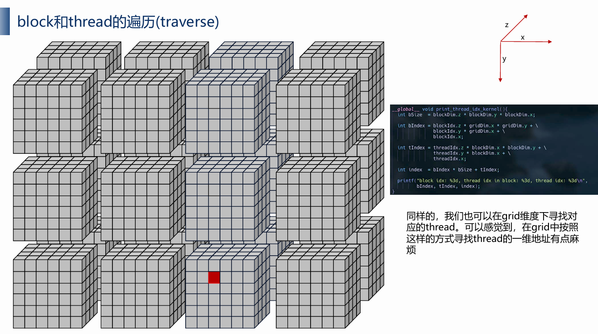
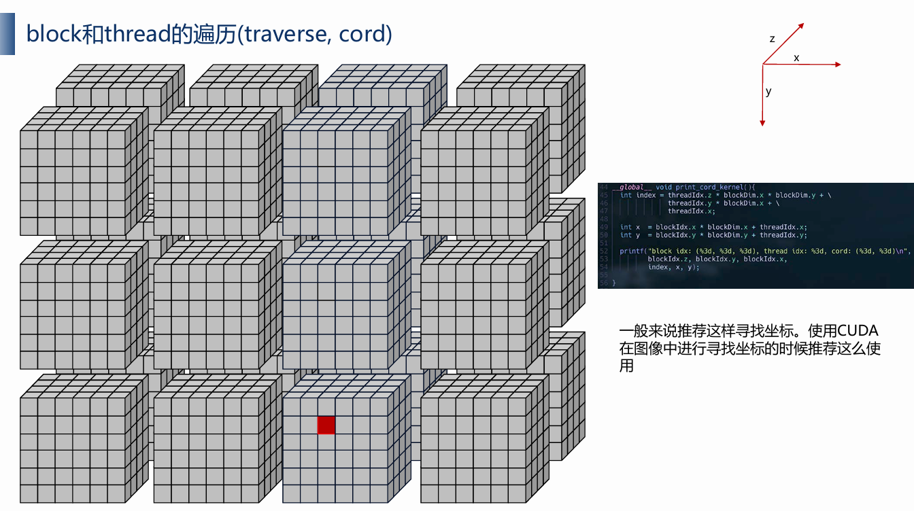
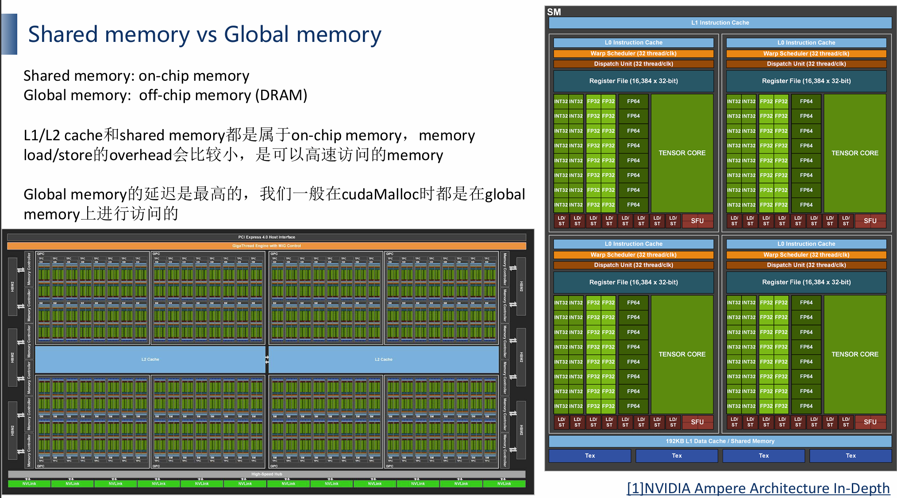
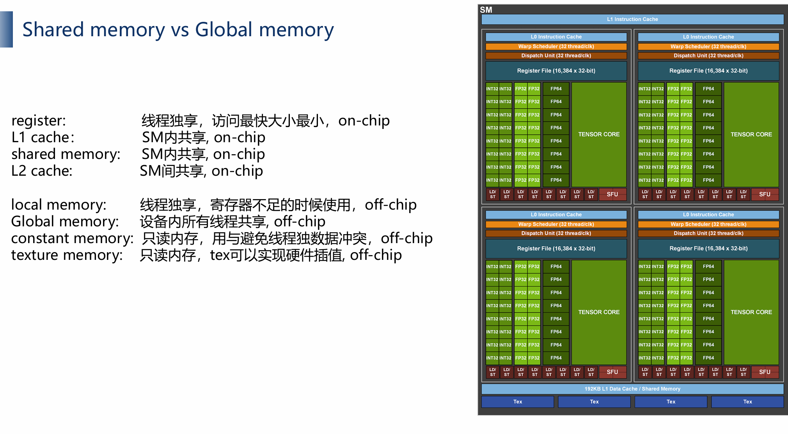

# CPU与GPU对比
collapsed:: true
	- ## 关键字
		- `ltency` #card
		  card-last-score:: 3
		  card-repeats:: 1
		  card-next-schedule:: 2024-11-11T13:23:37.707Z
		  card-last-interval:: 4
		  card-ease-factor:: 2.36
		  card-last-reviewed:: 2024-11-07T13:23:37.707Z
			- 完成一个指令所需要的时间
		- `memory latency` #card
		  card-last-interval:: 4
		  card-repeats:: 1
		  card-ease-factor:: 2.36
		  card-next-schedule:: 2024-11-11T13:23:44.948Z
		  card-last-reviewed:: 2024-11-07T13:23:44.948Z
		  card-last-score:: 3
			- CPU/GPU从memory获取数据所需要的等待时间。
			- CPU并行处理的优化的主要方向
		- `throughput` #card
		  card-last-interval:: 4
		  card-repeats:: 1
		  card-ease-factor:: 2.36
		  card-next-schedule:: 2024-11-11T13:23:46.804Z
		  card-last-reviewed:: 2024-11-07T13:23:46.804Z
		  card-last-score:: 3
			- 吞吐量，单位时间内可以执行的指令数
			- GPU并行处理的优化的主要方向
		- `Multi-threading` #card
			- 多线程
	- ## CPU与GPU在并行处理的优化方向
		- CPU主要目标在于减少memory latency
			- 因为CPU程序一般命令比较复杂，并行化的程度不会很高，加再多和core后续也无法提高运行速率，而主要卡点在于memory latency
		- GPU主要目标在于提高throughput
			- GPU主要用于图像处理，大量的计算，这些计算都是独立的，天生适合并行处理。
	- ## CPU如何优化？
		- 提高throughput
			- Pipeline
				- CPU instruction pipeline
					- 一条指令可以分为取指令等一系列操作，就可以将其流水线化
					- 
			- multi-thread
				- 提高throughput的一种优化
				- 多线程
				- 让因为数据IO或者cache miss而stall的core去做其他事情
		- 减少memory latency
			- cache hierarchy
				- 多级缓存，L1 L2 L3 cache
			- pre-fetch
				- 提前取数据等
				- 将需要的数据、指令等一次性读出
			- branch-prediction
				- 分支预测(if-else等条件语句)。根据以往的branch走向，去预测下一次branch的走向，从而pre-fetch等，预测失败就rollback就可以
				- CPU有专门的硬件负责预测
	- ## GPU的特点
		- SIMT
			- 类似于SIMD的一种概念，将一条指令分给大量的thread去执行，thread间的调度是由warp(GPU体系架构中有一个warp schedular专门负责管理线程调度)来负责管理
			- [[SIMD]]
	- ## CPU与GPU的异同：
		- CPU：
			- 适合复杂的逻辑运算——因此过大的增大core的数量并不能很好的提高throughput
			- 优化方向在于减少memory latency
			- 不同于GPU，硬件上有专门分支预测器去实现 branch-prediction
		- GPU
			- 适合简单单一的大规模运算。如图像处理、深度学习等
			- 优化方向在于提高throughput
			- 不同于CPU，GPU硬件上有wrap schedular去进行多线程的调度
			- 由于GPU经常处理大规模运算，会提前把数据准备好，所以在throughtput很高的情况下，GPU内部的memory latency上带来的性能损失不明显，但是CPU和GPU之间通信时产生的memory latency需要重视
- # tensorrt环境搭建
  collapsed:: true
	- > 理解cuda,cudnn,tensorrt的版本选择，以及如何使用docker
	- tensorrt依赖cuda和cudnn，所以看见tensorrt版本后可以去`tensorrt release note`去找到对应版本，以及支持的cuda 和 cudnn版本
	- 在官网下载run脚本安装cuda
	  logseq.order-list-type:: number
		- 多版本管理：将`/usr/local/cuda`软链接指向不同的cuda版本，然后修改环境变量`PATH`、`LD_LIBRARY_PATH`即可
		  logseq.order-list-type:: number
		- 版本查看`nvcc -V`
		  logseq.order-list-type:: number
	- 安装cudnn
	  logseq.order-list-type:: number
		- ```bash
		  Navigate to your <cudnnpath> directory containing the cuDNN tar file.
		  Unzip the cuDNN package.
		  $ tar -xvf cudnn-linux-x86_64-8.x.x.x_cudaX.Y-archive.tar.xz
		  Copy the following files into the CUDA toolkit directory.
		  $ sudo cp cudnn-*-archive/include/cudnn*.h /usr/local/cuda/include 
		  $ sudo cp -P cudnn-*-archive/lib/libcudnn* /usr/local/cuda/lib64 
		  $ sudo chmod a+r /usr/local/cuda/include/cudnn*.h /usr/local/cuda/lib64/libcudnn*
		  ```
		- 查看cudnn版本：在cudnn的头文件中有一个`cudnn_version.h`其中记录了版本信息
	- 安装tensorrt
	  logseq.order-list-type:: number
		- 解压下载的压缩包即可有`bin`，`include`和`lib`文件夹了，可以修改环境变量`PATH`，`LD_LIBRARY_PATH`。同理可以用环境变量来进行版本控制
		- 验证安装成功：`trtexec`，并且在末尾会显示版本信息
		- 可以进入sample文件夹中学习一些API示例，或者make运行一下
- # NVIDIA Docker #docker
  collapsed:: true
	- 根据官方文档安装NVIDIA Container toolkit([Installing the NVIDIA Container Toolkit — NVIDIA Container Toolkit 1.16.2 documentation](https://docs.nvidia.com/datacenter/cloud-native/container-toolkit/latest/install-guide.html#configuration))
	  logseq.order-list-type:: number
		- `dpkg -l | grep nvidia`可以查看相关包，有`nvidia-docker2`、`nvidia-container-toolkit`、`nvidia-container-toolkit-base`就安装成功了
		  logseq.order-list-type:: number
		- 运行
		  logseq.order-list-type:: number
			- ```bash
			  sudo docker   run       --rm      --runtime=nvidia   --gpus all     ubuntu nvidia-smi
			             运行镜像   运行完后就删除                  使用主机所有gpu        
			  ```
	- 寻找不同的镜像版本：NGC
	  logseq.order-list-type:: number
		- [TensorRT | NVIDIA NGC](https://catalog.ngc.nvidia.com/orgs/nvidia/containers/tensorrt/tags)里面会有不同版本的镜像，但是看不到镜像里面的具体内容信息
		- 可以在[Container Release Notes :: NVIDIA Deep Learning TensorRT Documentation](https://docs.nvidia.com/deeplearning/tensorrt/container-release-notes/index.html)寻找对应的tag查看对应的内容信息
		- 然后寻找一个同时满足自己主机端驱动支持的cuda版本以及需要的版本的镜像
	- 创建`dockerfile`
	  logseq.order-list-type:: number
- # cuda basic #cuda
  collapsed:: true
	- ## grid block thrad逻辑结构（内存模型）
	  collapsed:: true
		- {:height 655, :width 1188}
		- 逻辑结构如左图所示(并不对应具体的硬件设计)，存储结构如右图所示
		- 左图解释：
			- 一个kernel代表一个核函数，一个核函数包含一个grid，一个grid包含多个block(一维~三维)，一个block包含多个thread(一维~三维)。
		- 右图解释：
			- 一个grid的所有thread共享三个内存，每个thread有独立的register 和 local memory，同一个block中的thread有一个共享的shared memory
		- 深蓝：
			- 每个线程处理器（SP）都用自己的registers（寄存器）。对应上右图的thread
			- 每个SP都有自己的local memory（局部内存），register和local memory只能被线程自己访问
			- 每个多核处理器（SM）内都有自己的shared memory（共享内存），shared memory 可以被线程块内所有线程访问。相当于block
			- 一个GPU的所有SM共有一块global memory（全局内存），不同线程块的线程都可使用
		- ### CUDA内存读写速度
			- 每个线程读写速度对比：
				- 各自线程寄存器(~1周期)
				- 线程块共享内存(~5周期)
				- Grid全局内存(~500周期)
				- Grid常量内存(~5周期)
	- ## thread遍历，thread index计算
	  collapsed:: true
		- 整体思路都是按照z->y->x三个轴依次遍历。
		- 三个轴的朝向如下所示
		- ### block 中 thread 的遍历
		  collapsed:: true
			- 
			- ```cpp
			  __global__ void print_threadidx_in_block() {
			      int index = threadIdx.z * blockDim.x * blockDim.y + 
			                  threadIdx.y * blockDim.x + threadIdx.x;
			      printf("blockDim.x = %d, blockDim.y = %d, blockDim.z = %d, index = %d\n",
			              blockDim.x, blockDim.y, blockDim.z, index);
			  }
			  ```
		- ### grid 中 thread 的遍历
		  collapsed:: true
			- 思路：先计算对应于哪一个block，再用上述方式计算block中的索引，最后加上前面block的偏移
			- 
			- ```cpp
			  __global__ void print_threadidx_in_grid() {
			      int block_size = blockDim.x * blockDim.y * blockDim.z;
			  
			      int block_index = blockIdx.z * gridDim.x * gridDim.y + 
			                        blockIdx.y * gridDim.x + blockIdx.x;
			      int thread_index = threadIdx.z * blockDim.x * blockDim.y + 
			                         threadIdx.y * blockDim.x + threadIdx.x;
			      int in_grid_index = block_index * block_size + thread_index;
			      printf("blockDim.x = %d, blockDim.y = %d, blockDim.z = %d, block index = %d\n",
			              blockDim.x, blockDim.y, blockDim.z, block_index);
			      printf("gridDim.x = %d, gridDim.y = %d, gridDim.z = %d, thread index = %d, in_grid_index = %d\n",
			              gridDim.x, gridDim.y, gridDim.z, thread_index, in_grid_index);
			  }
			  ```
			- 在图像中一般寻找的是坐标，因此更推荐以下方法：
				- 
				- 图中红点的x坐标就是`blockIdx.x * blockDim.x + threadIdx.x`，y坐标就是`blockDim.y * blockIdx.y + threadIdx.y`
				-
	- ## 线程束(wrap)
	  collapsed:: true
		- SM采用的SIMT(Single-Instruction, Multiple-Thread，单指令多线程)架构，warp(线程束)是最基本的执行单元，一个warp包含32个并行thread，这些thread以不同数据资源执行相同的指令。warp本质上是线程在GPU上运行的最小单元。
			- 单指令多线程，大白话就是一个线程束的线程执行的是同一条指令，只不过使用的数据不一样
		- 当一个kernel被执行时，grid中的线程块被分配到SM上，一个线程块的thread只能在一个SM上调度，SM一般可以调度多个线程块，大量的thread可能被分到不同的SM上。每个thread拥有它自己的程序计数器和状态寄存器，并且用该线程自己的数据执行指令，这就是所谓的Single Instruction Multiple Thread(SIMT)。
		- 由于warp的大小为32，所以block所含的thread的大小一般要设置为32的倍数。
	- ## 硬件概念
	  collapsed:: true
		- ### SP
			- cuda core也就是stream processor(SP)，是GPU最基本的处理单元。具体指令和任务都是在SP上处理的，GPU并行计算也就是很多SP同时处理，一个SP可以执行一个thread，但是实际上并不是所有的thread能够在同一时刻执行。这里我理解应该是以wrap为单位的并行。
		- ### SM
			- stream multiprocessor。SM包含SP和一起其他资源，一个SM可以包含多个SP。SM可以看作GPU的核心，GPU中每个SM都设计成支持数以百计的线程并行执行，并且每个GPU都包含了很多的SM，所以GPU支持成百上千的线程并行执行。大白话来理解就是SM相当于一个CPU包含了成百计的核，支持成百计的线程并行。
			- ==一个SM在一个时刻只能处理一个block==
	- ## CUDA中的内存模型分为以下几个层次：
	  collapsed:: true
		- 线程处理器（SP）对应线程（thread）
		- 多核处理器（SM）对应线程块（thread block）
		- 设备端（device）对应线程块组合体（grid）
	- ## CPU与GPU同步的几种函数
	  collapsed:: true
		- ```cpp
		      cudaDeviceSynchronize(); CPU与GPU端完成同步，CPU不执行之后的语句，直到这个语句以前的所有cuda操作结束
		      cudaStreamSynchronize(); 与cudaDeviceSynchronize类似，但是这个是针对某一个stream的，只同步指定stream中的cpu/gpu，其他的不管
		      cudaThreadSynchronize(); 现在已经不推荐使用的方法
		      __syncthreads();         线程块内同步
		  ```
	- ## 共享内存
	  collapsed:: true
		- 我们一般在`cudaMalloc`时都是在global memory上进行访问的
		- 
		- 
		- `on-chip`:芯片上。`off-chip`芯片外
		- `texture memory`也有一个texture cache，在上右图底部Tex，是on-chip的，比global memory、texture memory快
		-
		- 概念：一种特殊类型的内存，其内容在源代码中被显式声明和使用
			- 位于处理器中
			- 以更高的速度访问(延迟&吞吐)
			- 仍然被内存访问指令访问
			- 在计算机体系结构中通常称为暂存存储器
		- 共享内存特点
			- 读取速度等同于缓存，在很多显卡上，缓存和共享内存使用的是同一块硬件，并且可以配置大小
			- 共享内存属于线程块block，可以被一个block内的所有线程访问
			- 共享内存的两种申请空间方式，静态申请和动态申请
			- 共享内存的大小只有几十K，过度使用共享内存会降低程序的并行性
				- 共享内存的大小有限，过度使用共享内存相当于过度频繁读写共享内存，过度频繁读写使得有些线程要排队，并行变串行，效率大幅降低
		- 使用方法
			- 申请
				- `__shared__`关键字
				- 静态申请：申请时就指定大小
					- ```cpp
					  __shared__ int s[64]; // 申请时指定大小
					  ```
				- 动态申请：申请时不指定大小，调用时才定义
					- ```cpp
					  extern __shared__ int s[];// 为了区别静态申请，需要加上exctern关键字。告诉编译器
					  // 那么需要分配的共享内存的大小就需要在调用核函数的时候明确的指出了：
					  dynamicReverse<<<1, n, n * sizeof(int)>>>; // n * sizeof(int) 的大小
					  ```
			- 使用
				- 将每个线程从全局索引位置读取元素，将它存储到共享内存之中。
				- 注意数据存在着交叉，应该将边界上的数据拷贝进来。
				- 块内线程同步：`__syncthreads()`
					- __syncthreads()将确保线程块中的每个线程都执行完`__syncthreads()` 前面的语句后，才会执行下一条语句。
						- 所以在进行线程同步的时候不可以使用 if-else 等分支语句。
							- ```cpp
							  // 下面的代码可能会导致块中的线程无限期地等待对方， 
							  // 因为块中的所有线程没有达到相同的障碍点
							  if (threadID % 2 == 0) {
							      __syncthreads();
							  } else {
							      __syncthreads();
							  }
							  ```
					- `__syncthreads`用于协调同一块中线程间的通信。 当块中的某些线程访问共享内存或全 局内存中的同一地址时，会有潜在问题（写后读、 读后写、 写后写），这将导致在那些内存位置产生未定义的应用程序行为和未定义的状态。 可以通过利用冲突访问间的同步线程 来避免这种情况。
					- 告诉其他线程我在这块进行了更改，不要出现时序上的错乱，如：读后写、写后写等
					- 试想，一个block的所有线程都会操作同一个共享内存，达到数据共享的目的，那么其中一个对其有了操作，肯定要通知其他人进行同步，不要用旧的数据，不要用错了。类似git仓库的操作了，我push了一个代码，也得通知其他人pull到本地，不要用错了
		- ==使用思路==
			- 思路上就是block中的第一个线程从global memory读取数据到共享内存后，在`_syncthreads`等待同步，其余线程后续读取该数据就会直接从`shared memory`读取了，不会再访问global memory，这就是速度提升的原因。
- # cuda ERROR Handle #cuda
  collapsed:: true
	-
- # Nsight system and compute——cuda性能分析
  collapsed:: true
	- ## 安装
		- 直接搜索`Nsight system download`和`Nsight compute download`即可
			- [Nsight Systems - Get Started | NVIDIA Developer](https://developer.nvidia.com/nsight-systems/get-started)
			- [Getting Started with Nsight Compute | NVIDIA Developer](https://developer.nvidia.com/tools-overview/nsight-compute/get-started)
		-
-
-
-
-