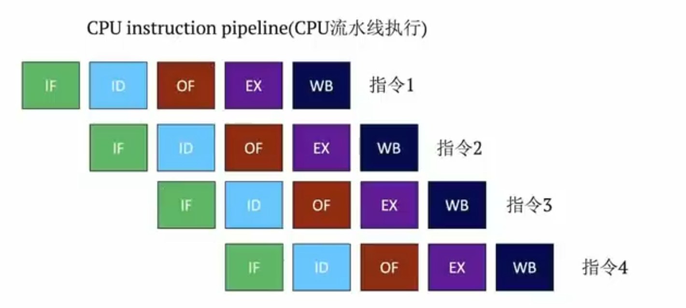

# CPU与GPU对比
background-color:: yellow
	- ## 关键字
		- `ltency` #card
		  card-last-score:: 3
		  card-repeats:: 1
		  card-next-schedule:: 2024-11-11T13:23:37.707Z
		  card-last-interval:: 4
		  card-ease-factor:: 2.36
		  card-last-reviewed:: 2024-11-07T13:23:37.707Z
			- 完成一个指令所需要的时间
		- `memory latency` #card
		  card-last-interval:: 4
		  card-repeats:: 1
		  card-ease-factor:: 2.36
		  card-next-schedule:: 2024-11-11T13:23:44.948Z
		  card-last-reviewed:: 2024-11-07T13:23:44.948Z
		  card-last-score:: 3
			- CPU/GPU从memory获取数据所需要的等待时间。
			- CPU并行处理的优化的主要方向
		- `throughput` #card
		  card-last-interval:: 4
		  card-repeats:: 1
		  card-ease-factor:: 2.36
		  card-next-schedule:: 2024-11-11T13:23:46.804Z
		  card-last-reviewed:: 2024-11-07T13:23:46.804Z
		  card-last-score:: 3
			- 吞吐量，单位时间内可以执行的指令数
			- GPU并行处理的优化的主要方向
		- `Multi-threading` #card
			- 多线程
	- ## CPU与GPU在并行处理的优化方向
		- CPU主要目标在于减少memory latency
			- 因为CPU程序一般命令比较复杂，并行化的程度不会很高，加再多和core后续也无法提高运行速率，而主要卡点在于memory latency
		- GPU主要目标在于提高throughput
			- GPU主要用于图像处理，大量的计算，这些计算都是独立的，天生适合并行处理。
	- ## CPU如何优化？
		- 提高throughput
			- Pipeline
				- CPU instruction pipeline
					- 一条指令可以分为取指令等一系列操作，就可以将其流水线化
					- 
			- multi-thread
				- 提高throughput的一种优化
				- 多线程
				- 让因为数据IO或者cache miss而stall的core去做其他事情
		- 减少memory latency
			- cache hierarchy
				- 多级缓存，L1 L2 L3 cache
			- pre-fetch
				- 提前取数据等
				- 将需要的数据、指令等一次性读出
			- branch-prediction
				- 分支预测(if-else等条件语句)。根据以往的branch走向，去预测下一次branch的走向，从而pre-fetch等，预测失败就rollback就可以
				- CPU有专门的硬件负责预测
	- ## GPU的特点
		- SIMT
			- 类似于SIMD的一种概念，将一条指令分给大量的thread去执行，thread间的调度是由warp(GPU体系架构中有一个warp schedular专门负责管理线程调度)来负责管理
			- [[SIMD]]
	- ## CPU与GPU的异同：
	  background-color:: red
		- CPU：
			- 适合复杂的逻辑运算——因此过大的增大core的数量并不能很好的提高throughput
			- 优化方向在于减少memory latency
			- 不同于GPU，硬件上有专门分支预测器去实现 branch-prediction
		- GPU
			- 适合简单单一的大规模运算。如图像处理、深度学习等
			- 优化方向在于提高throughput
			- 不同于CPU，GPU硬件上有wrap schedular去进行多线程的调度
			- 由于GPU经常处理大规模运算，会提前把数据准备好，所以在throughtput很高的情况下，GPU内部的memory latency上带来的性能损失不明显，但是CPU和GPU之间通信时产生的memory latency需要重视
- # tensorrt环境搭建
  background-color:: yellow
	- > 理解cuda,cudnn,tensorrt的版本选择，以及如何使用docker
	- tensorrt依赖cuda和cudnn，所以看见tensorrt版本后可以去`tensorrt release note`去找到对应版本，以及支持的cuda 和 cudnn版本
	- 在官网下载run脚本安装cuda
	  logseq.order-list-type:: number
		- 多版本管理：将`/usr/local/cuda`软链接指向不同的cuda版本，然后修改环境变量`PATH`、`LD_LIBRARY_PATH`即可
		  logseq.order-list-type:: number
		- 版本查看`nvcc -V`
		  logseq.order-list-type:: number
	- 安装cudnn
	  logseq.order-list-type:: number
		- ```bash
		  Navigate to your <cudnnpath> directory containing the cuDNN tar file.
		  Unzip the cuDNN package.
		  $ tar -xvf cudnn-linux-x86_64-8.x.x.x_cudaX.Y-archive.tar.xz
		  Copy the following files into the CUDA toolkit directory.
		  $ sudo cp cudnn-*-archive/include/cudnn*.h /usr/local/cuda/include 
		  $ sudo cp -P cudnn-*-archive/lib/libcudnn* /usr/local/cuda/lib64 
		  $ sudo chmod a+r /usr/local/cuda/include/cudnn*.h /usr/local/cuda/lib64/libcudnn*
		  ```
		- 查看cudnn版本：在cudnn的头文件中有一个`cudnn_version.h`其中记录了版本信息
	- 安装tensorrt
	  logseq.order-list-type:: number
		- 解压下载的压缩包即可有`bin`，`include`和`lib`文件夹了，可以修改环境变量`PATH`，`LD_LIBRARY_PATH`。同理可以用环境变量来进行版本控制
		- 验证安装成功：`trtexec`，并且在末尾会显示版本信息
		- 可以进入sample文件夹中学习一些API示例，或者make运行一下
- # NVIDIA Docker
  background-color:: yellow
	- 根据官方文档安装NVIDIA Container toolkit([Installing the NVIDIA Container Toolkit — NVIDIA Container Toolkit 1.16.2 documentation](https://docs.nvidia.com/datacenter/cloud-native/container-toolkit/latest/install-guide.html#configuration))
	  logseq.order-list-type:: number
		- `dpkg -l | grep nvidia`可以查看相关包，有`nvidia-docker2`、`nvidia-container-toolkit`、`nvidia-container-toolkit-base`就安装成功了
		  logseq.order-list-type:: number
		- 运行
		  logseq.order-list-type:: number
			- ```bash
			  sudo docker   run       --rm      --runtime=nvidia   --gpus all     ubuntu nvidia-smi
			             运行镜像   运行完后就删除                  使用主机所有gpu        
			  ```
	- 寻找不同的镜像版本：NGC
	  logseq.order-list-type:: number
		- [TensorRT | NVIDIA NGC](https://catalog.ngc.nvidia.com/orgs/nvidia/containers/tensorrt/tags)里面会有不同版本的镜像，但是看不到镜像里面的具体内容信息
		- 可以在[Container Release Notes :: NVIDIA Deep Learning TensorRT Documentation](https://docs.nvidia.com/deeplearning/tensorrt/container-release-notes/index.html)寻找对应的tag查看对应的内容信息
		- 然后寻找一个同时满足自己主机端驱动支持的cuda版本以及需要的版本的镜像
	- 创建`dockerfile`
	  logseq.order-list-type:: number
-
-
-
-
-
-