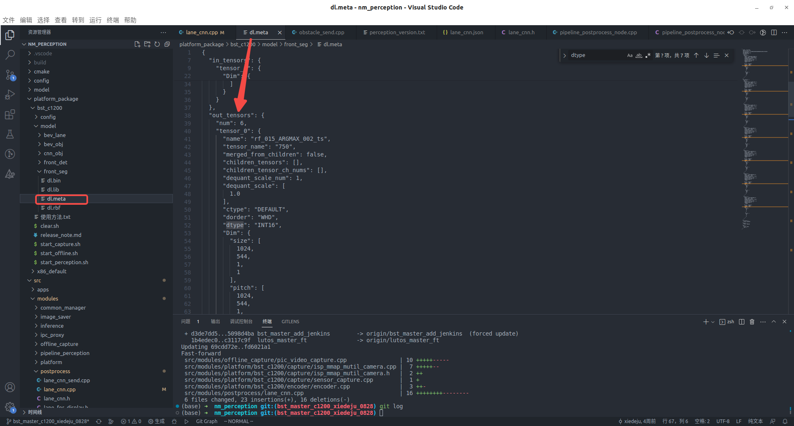

- 状态： #各项目状态
	- 0809：板端跑起来会卡在ob，lane fusion release库异常大 188M。
	- 0809：使用am62a_sdk_9.2后处理和common
	- 0824：排查出是由于板端做了虚拟外参，图片貌似没做导致的外参不一样。改了配置关闭虚拟外参后就好了。另外lane cnn.json文件中估pitch的范围太小了，目前c1200的图片清晰，模型检测较好，我将其范围放开了。
	- 0830：
		- 实车上未识别路沿，am62a的逻辑，只显示邻近ego的路沿，被直接挪过来了。
		- 虚实线类别错误，平台传递模型的type和color的指针类型错误，应该是int16的，可以按照下方的方法查看
		- ((66bdc016-7d64-4d0d-8ed2-50e790870737))
	- 0902：虚实问题另一个原因是由于时间戳导致。具体为什么时间戳导致，可能是由于时间戳和bag对不上？==至此，c1200上车道线没有大的问题==
	- 0910：上了博哥的bev lane相关合并，我的一些case的修复：车道线匹配的逻辑、引导线删线的逻辑
	- 0913：修复匝道地图估pitch没有关闭强制平行的bug
	- 1008：c1200上cnn马上会被放弃，切到3V做过渡，最终切到BEV LANE
	- 1009：十月末演示继续用cnn。
	- 1023：虚线底端脑补问题优先级不如cutin脑补问题高，因此暂时搁置。优先解cutin脑补问题
	- 1105：本月演示都是基于当前的，周视+当前2v带停止线cnn
- 使用前`source /opt/bstos/linux-23/environment-setup-sdk`
- todo：按先后顺序排列
  collapsed:: true
	- DONE lane fusion、lane perception可以正常编译。
	  :LOGBOOK:
	  CLOCK: [2024-07-30 Tue 11:37:30]--[2024-08-09 Fri 15:18:05] =>  243:40:35
	  :END:
		- 目前lane perception在一边修改一边编译。
			- DONE 修改获取外参矩阵的接口
			- ~~TODO 修改虚拟相机和自己相机位置的映射~~
		- lane fusion应该可以直接编译
	- DONE 在SetFeatureBuffer里面添加string的assert判断，以快速定位输入head是否对齐
	  :LOGBOOK:
	  CLOCK: [2024-07-30 Tue 11:38:23]--[2024-07-30 Tue 11:44:54] =>  00:06:31
	  :END:
	- ~~TODO 修改内部相机和虚拟相机的对应关系。~~
	- ~~TODO 修改过程中可以同时接受两种：bev、2d的输入~~
	-
- ~~c1200 refactor 停滞废弃~~
  collapsed:: true
	- 用一个string字符串在common库中获取对应的VCameraId，然后去作对应的坐标系转换。
	- 因此需要在初始化中，保存share_ptr和VCameraId。
	-
- ~~c1200模型输出类型全是`uint8`的~~
  collapsed:: true
	- [可以使用这个脚本解析模型输出的bin、csv文件](https://yhikd4my59.feishu.cn/docx/NWhkdcwvBo7PeNxPk8dc8vLVnbb)
	- `nm_perception`中有一个`.meta`文件，记录了模型输出的各种信息，包括输出指针的类型等：
	  id:: 66bdc016-7d64-4d0d-8ed2-50e790870737
		- 