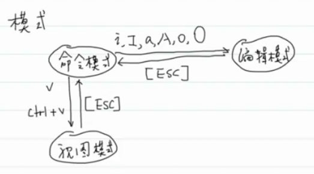
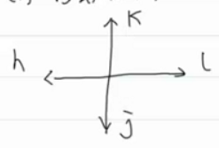

- VIM（编辑文件内容） #vim
	- 编辑器
		- 所见即所得：word、markdown、notepad...
		- 命令编辑器：vim，emacs
	- VI-->VIM
		- VI improved：vi改进版
	- **模式**
		- 
		- `i`：在光标前插入
		- `I`：在行首插入
		- `a`：在光标后面插入，after
		- `A`：在行尾插入。
		- `o`：在下一行插入（另开一行）
		- `O`：在上一行插入（另开一行）
	- ## 1.命令模式
		- **长命令**：以`:`开头，以[ENTER]结尾的命令
		- **短命令**：i、a、o...（直接敲就可以）
		-
		- 移动光标：
			- 
		- 翻页：
			- `ctrl+f`：下一页（forward）
			- `ctrl+b`：下一页（backward）
			- `ctrl+d`：下半页（down）
			- `ctrl+u`：下半页（up）
			- `[n]-`：往上走n行
			- `[n]+`：往下走n行
			- `[n]G/:[n]`：去往n行
			- `gg`：去往文件的开头
			- `G`：去往文件的末尾
			- `H`：页首（head）
			- `L`：页的最后一行行首，（tail）
			- `^`：行首
			- `$`：行尾
			- `w`：下一个单词
			- `b`：上一个单词
		- 在命令模式下编辑文本：
			- 删除（相当于剪切）：--->d：delete
			- `x`：删除一个字符
			- `dw`：删除一个单词
			- `[n]dw/d[n]w`：删除多个单词
			- `dd`：删除一行
			- `[n]dd/d[n]d`：删除多行
			- `:x,yd`：删除[x,y]行
			- `d^`：删除到行首
			- `d$`：删除到行尾
			- `dt?`：删除到？这个字符。t：to
				- `dt)`：删除到)
				- `dt"`：删除到"
		- 粘贴
			- `p`-->paste：粘贴
			- `u`-->undo：撤销
			- `ctrl+r`：恢复上一次的操作：r：recovery
		- 拷贝
			- y-->yank：拷贝
			- `yy`：拷贝一行
			- `[n]yy/y[n]y`：拷贝n行
			- `:x,yy`：拷贝[x,y]行
			- `yw`：拷贝一个单词
			- `[n]yw/y[n]w`：拷贝n个单词
		- 查找和替换
			- 查找：
				- /pattern：匹配正则表达式
					- n：下一个匹配项
					- N：上一个匹配项
			- 替换：
				- `:s/pattern/substitute/选项`
					- pattern：正则表达式
					- substitute：替换的表达式
					- 默认只会替换光标所在行的第一个匹配项
					- 选项：
						- g（globally）：全局：替换光标所在行的所有匹配项
							- 替换的单位是行，所以g的全局代表的就是行 04：10：06
						- `:x,ys/pattern/substitute/g`：替换[x,y]行所有匹配项
						- `:%s/pattern/substitute/g`：对全文进行替换
						-
	- ## 2.视图模式
		- 作用：选择范围--->目的：复制和删除
		-
		- 行选模式：`v`
		- 竖选模式：`ctrl+v`
		-
		- 批量注释：
			- 1.`ctrl+v`进入竖选模式
			- 2.选择范围
			- 3.输入大写`I`
			- 4.输入`//`
			- 5.[ESC]
		- 删除注释：
			- 1.`ctrl+v`进入竖选模式
			- 2.选择范围
			- 3.d删除
		- 全文代码对齐：`gg=G`
		-
	- ## 3.对文件的操作
		- `:w`：保存。^^**千万不要按 ctrl+s ，不然vim会进入僵死状态，按啥都没用， ctrl+k 退出僵死状态**^^
		- `:q`：退出
		- `:q!`：不保存退出，强制退出
		- `:wq`：保存退出
	- ## 4.多窗口
		- 上下分屏
			- `:new`
			- `:split`：分割
			- `:sp`
		- 切换窗口：`ctrl+ww`
		- 退出：
			- `:q`：退出光标所在的窗口
			- `:qa`：退出所有窗口
		-
		- 上下分屏的命令前加 v ，可以左右分屏
			- `:vnew`、`:vsplit`、`:vsp`
		-
	- ## 5.多标签
		- `:tabnew`
		-
		- 如何切换标签？
			- `gt`：下一个标签：goto？
			- `gT`:上一个标签
		-
	- ## 6.配置vim
		- `~/.vimrc`：rc结尾：配置文件
			- rc：running command
		- 每次启动vim时，会执行.vimrc里面的命令，（相当于脚本）
		-
	- ## 7.练习手册
	  collapsed:: true
		- vimtutor
	-